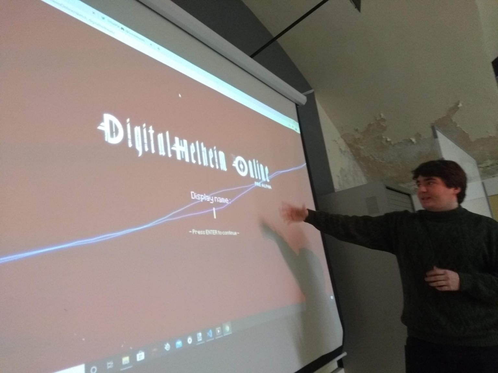

<h1 align="center">Welcome to Digital Helheim Online 👋</h1>

  
  
  

> 2D game developed with p5.js and Node.js

## Author

👤 **Pol Surriel & Eric Garcia**

* Twitter: [@psurriel](https://twitter.com/psurriel) & [@ergare17](https://twitter.com/ergare17)
* Github: [@PolSurriel](https://github.com/PolSurriel) & [@eric98](https://github.com/eric98)
* LinkedIn: [@PolSurriel](https://linkedin.com/in/PolSurriel) & [@ericgarciareverter](https://linkedin.com/in/ericgarciareverter)
* Website: polsurriel.github.io

## Show your support

Give a ⭐️ if this project helped you!

***
_This README was generated with ❤️ by [readme-md-generator](https://github.com/kefranabg/readme-md-generator)_